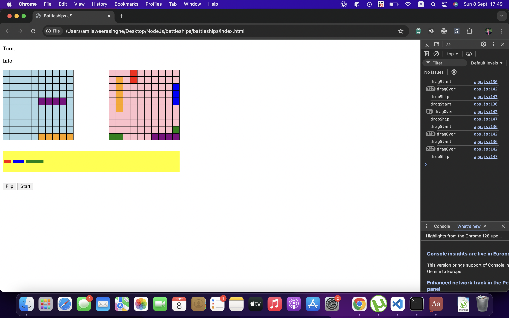

Dev design
1. create and render the initial elements with game board. blocks and the ships
2. Control ships with directions
3. Add two board to player and computer
4. Create the game board 
5. Add the different ships randomly into the game board , vertically / horizontally in random manner

Tech stack

* HTML5
* JavaScript
* CSS

Current progress

