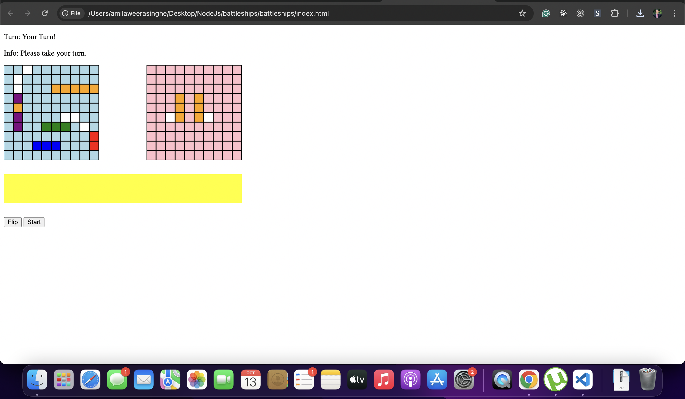

Dev design

// FE - static single player game 

1. create and render the initial elements with game board. blocks and the ships
2. Control ships with directions
3. Add two board to player and computer
4. Create the game board 
5. Add the different ships randomly into the game board , vertically / horizontally in random manner
6. Add logic to start game and validations before start game
7. Add logic to player turn
8. Add logic to computer turn
9. Integrate player turn and computer turn
10. Add logic to check the scores
11. Added conditions to determine the wins
12. Updated styles to hide computer ships

// Major update 02 - Node Js multiplayer mode

Tech stack

* HTML5
* JavaScript
* CSS
* NodeJs
* Express 
* Socket io

Current progress

